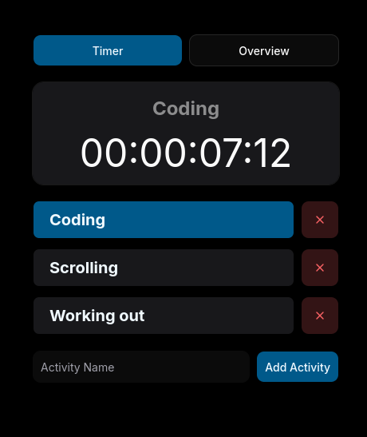
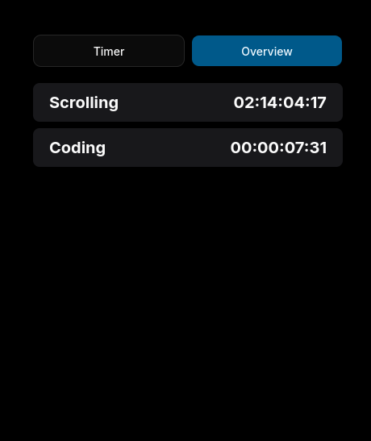

<p align="center">
  
</p>

<h1 align="center">Time Tracker</h1>

<h3 align="center" style="margin: 0.35rem 0 0; font-size: 24px;">A simple and focused way to track how you spend your time.</h3>

---

If you want to try it right away, the hosted version is available at [timer.karlito.dev](https://timer.karlito.dev/timer).

## Why use it?

Time Tracker helps you capture activities quickly and review your time in a clear overview.

### Features

- Manual time tracking for any activity you want to log
- A simple overview of your time spent across tasks
- Lightweight workflow designed for everyday use

## Screenshots

<p align="center">
  
  

</p>

## Run locally

### Requirements

- Docker Compose
- Bun

### Setup

1. Clone the repository:

```bash
git clone https://github.com/Karlito05/time-tracker.git
cd time-tracker
```

2. Install dependencies:

```bash
bun install
```

3. Create the Docker Compose config from the template:

```bash
cp docker-compose-template.yml docker-compose.yml
```

4. Update the environment values in `docker-compose.yml`:

- In the `db` service, set a strong `POSTGRES_PASSWORD`
- In the `nextjs-standalone-with-bun` service, set:
  - `DATABASE_URL`
  - `NEXTAUTH_URL`
  - `AUTH_SECRET`
  - `AUTH_GITHUB_ID`
  - `AUTH_GITHUB_SECRET`

Example `NEXTAUTH_URL` for local testing:

```text
http://localhost:3000
```

Generate a secure `AUTH_SECRET` with:

```bash
openssl rand -hex 32
# or
node -e "console.log(require('crypto').randomBytes(32).toString('hex'))"
```

5. Create your local environment file:

```bash
cp .env-template .env
```

> Note: the `DATABASE_URL` in `.env` often uses `localhost`, while the Docker service uses the container hostname `db`. Make sure the value matches the environment where the app is running.

6. Start the database:

```bash
docker compose up db -d
```

7. Apply the Prisma migrations:

```bash
bunx prisma migrate deploy
```

8. Start the app:

For local development:

```bash
bun dev
```

For a production-style Docker run:

```bash
docker compose up --build nextjs-standalone-with-bun
```

9. If you use GitHub OAuth, set the callback URL to:

```text
${NEXTAUTH_URL}/api/auth/callback/github
```
